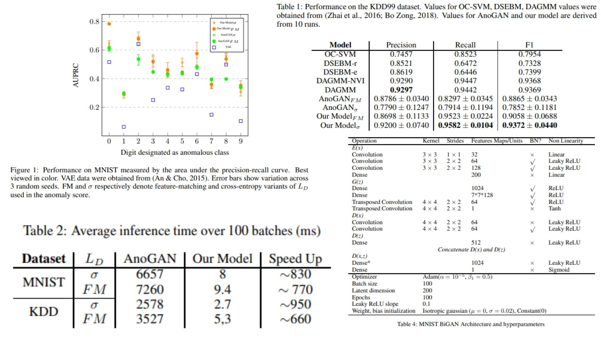

# 🧠 Efficient-GAN-Anomaly-Detection — Fast Anomaly Detection with BiGANs

This repository provides a **faithful PyTorch replication** of the  
**BiGAN-based anomaly detection framework** as described in the paper *Efficient GAN-based Anomaly Detection*.  

The goal is to **reproduce the encoder-generator-discriminator architecture, anomaly score computation, and training-less forward logic**, without running actual training or testing.  
The code is modular, interpretable, and ideal for research, experimentation, or educational purposes.

Highlights include:

* Encoder \(E\) mapping input \(x\) to latent vector \(z\)  
* Generator \(G\) reconstructing \(x\) from \(z\)  
* Discriminator \(D\) evaluating joint pairs \((x, z)\) for realism  
* Efficient anomaly score computation using **reconstruction + feature-matching loss**  
* Fully PyTorch-compatible, lightweight, and modular  

Paper reference: *[Efficient GAN-based Anomaly Detection](https://arxiv.org/abs/1802.06222)*  

---

## Overview — BiGAN for Anomaly Detection ✨



> The BiGAN jointly learns an encoder, generator, and discriminator to model **normal data distribution**, enabling fast anomaly detection.  

The architecture improves on standard GANs by:

* Learning \(E\) alongside \(G\) to directly map $$x \rightarrow z$$  
* Feeding **joint pairs** \((x, z)\) to the discriminator for richer feature evaluation  
* Computing anomaly score efficiently as:  

$$
A(x) = \alpha L_G(x) + (1-\alpha) L_D(x)
$$

Where:  
- $$L_G(x) = ||x - G(E(x))||_1\$$ measures reconstruction error  
- $$L_D(x) = ||f_D(x) - f_D(G(E(x)))||_1\$$ captures **feature similarity** via the discriminator  
- $$\alpha\$$ balances reconstruction vs feature-matching loss  

> Normal samples → low $$(A(x)\)$$, anomalous samples → high $$(A(x)\$$

---


## Core Mathematical Formulations 📐

- **Encoder mapping:**

```math
E: x \in \mathbb{R}^{B \times C \times H \times W} \longrightarrow z \in \mathbb{R}^{B \times \text{latent\_dim}}
````

* **Generator mapping:**

```math
G: z \in \mathbb{R}^{B \times \text{latent\_dim}} \longrightarrow \hat{x} \in \mathbb{R}^{B \times C \times H \times W}
```

* **Discriminator scoring joint pairs:**

```math
D: (x, z) \longrightarrow [0,1]
```

* **Anomaly score:**

```math
A(x) = \alpha \, ||x - G(E(x))||_1 + (1-\alpha) \, ||f_D(x) - f_D(G(E(x)))||_1
```

---

## Why BiGAN-based Anomaly Detection Matters 🌿

* Enables **fast and reliable anomaly detection** without iterative latent optimization  
* Leverages **feature-level comparison** for more robust detection  
* Fully **modular and interpretable**, ideal for research or educational use  
* Supports multiple datasets, e.g., MNIST and KDD99  

---

## Repository Structure 🏗️

```bash
Efficient-GAN-Anomaly-Detection/
├── src/
│   ├── layers/
│   │   ├── encoder.py                # Encoder E: x -> z
│   │   ├── generator.py              # Generator G: z -> x_hat
│   │   └── discriminator.py          # Discriminator D: (x,z) -> real/fake logits
│   │
│   ├── modules/
│   │   ├── anomaly_score.py          # Computes A(x) = α*L_G + (1-α)*L_D
│   │   └── feature_matching.py       # Feature extractor for discriminator layer
│   │
│   ├── model/
│   │   └── bi_gan.py                 # BiGAN assembly: E + G + D + optimizers
│   │
│   └── config.py                     # Hyperparameters: latent_dim, α, optimizer settings
│
├── images/
│   └── figmix.jpg
│
├── requirements.txt
└── README.md
```

---

## 🔗 Feedback

For questions or feedback, contact:  
[barkin.adiguzel@gmail.com](mailto:barkin.adiguzel@gmail.com)
